# LogForge

멀티테넌트 환경에서 외부 로그/트랜잭션을 수집→정제→일별 집계하는 Spring Batch 기반 ETL 파이프라인입니다. Kotlin 코루틴으로 외부 I/O 병렬성을 확보하고, Micrometer/Prometheus로 배치 운영 메트릭을 노출합니다.


## 핵심 기능
- `FetchRawLogsJob`: 활성 테넌트별 외부 API 호출로 원천 로그 수집 (코루틴 병렬, 파티셔닝)
- `NormalizeLogsJob`: RawLog를 정규화하고 실패 건을 별도 테이블에 적재
- `AggregateDailyMetricsJob`: 일/테넌트/이벤트 타입 기준 집계, idempotent upsert
- REST API: `/api/metrics/daily`로 집계 결과 조회 (필터, 페이징)
- Observability: `/actuator/health`, `/actuator/metrics`, `/actuator/prometheus` + 배치 메트릭 로그

## 아키텍처 개요


## 실행 전제
- JDK 21, Docker(선택: Postgres/Prometheus/Grafana 로컬 구성)
- 기본 DB: `jdbc:postgresql://localhost:5432/logforge` (계정/비밀번호 `logforge`), 환경 변수 `SPRING_DATASOURCE_URL` 등으로 재정의 가능
- 포트: 애플리케이션 `8080`, Prometheus `9090`, Grafana `3000`

## 빠른 시작 (로컬)
1) 인프라 기동 (선택)  
```bash
cd docker
docker compose up -d
```

2) 애플리케이션 실행  
```bash
./gradlew bootRun
# 또는 빌드 후 실행: ./gradlew bootJar && java -jar build/libs/logforge-0.0.1-SNAPSHOT.jar
```

## Batch Job 실행 예시
Job은 기본 비활성(`spring.batch.job.enabled=false`)이므로 실행 시 파라미터를 함께 전달합니다. ISO-8601 Instant 형식의 `from`/`to`가 필수입니다.
```bash
# 원천 로그 수집
./gradlew bootRun --args="--spring.batch.job.name=fetchRawLogsJob from=2025-01-01T00:00:00Z to=2025-01-01T02:00:00Z"

# 정규화
./gradlew bootRun --args="--spring.batch.job.name=normalizeLogsJob from=2025-01-01T00:00:00Z to=2025-01-01T02:00:00Z"

# 일별 집계
./gradlew bootRun --args="--spring.batch.job.name=aggregateDailyMetricsJob from=2025-01-01T00:00:00Z to=2025-01-02T00:00:00Z"
```

## E2E 시나리오 (예시)
1) **Mock 외부 로그 API 준비** (예: MockServer)  
```bash
docker run -d --name logforge-mock --rm -p 1080:1080 mockserver/mockserver
# 샘플 응답 등록: from/to 파라미터가 들어오면 JSON 배열 반환
curl -v -X PUT "http://localhost:1080/mockserver/expectation" \
  -H "content-type: application/json" \
  -d '{
    "httpRequest": { "method": "GET", "path": "/api/logs" },
    "httpResponse": {
      "statusCode": 200,
      "headers": { "Content-Type": ["application/json"] },
      "body": [
        { "occurredAt": "2025-01-01T00:00:00Z", "payload": "{\"event\":\"order\",\"amount\":1500}" },
        { "occurredAt": "2025-01-01T01:00:00Z", "payload": "{\"event\":\"order\",\"amount\":700}" }
      ]
    }
  }'
```

2) **테넌트 등록** (테스트용)  
```sql
insert into tenants (name, status, external_api_base_url, api_key, created_at, updated_at)
values ('tenant-a', 'ACTIVE', 'http://host.docker.internal:1080', 'local-key', now(), now());
```

3) **배치 실행** (수집 → 정규화 → 집계)  
```bash
./gradlew bootRun --args="--spring.batch.job.name=fetchRawLogsJob from=2025-01-01T00:00:00Z to=2025-01-01T02:00:00Z"
./gradlew bootRun --args="--spring.batch.job.name=normalizeLogsJob from=2025-01-01T00:00:00Z to=2025-01-01T02:00:00Z"
./gradlew bootRun --args="--spring.batch.job.name=aggregateDailyMetricsJob from=2025-01-01T00:00:00Z to=2025-01-02T00:00:00Z"
```

4) **집계 조회**  
```bash
curl "http://localhost:8080/api/metrics/daily?tenantId=1&fromDate=2025-01-01&toDate=2025-01-01"
```

5) **모니터링 확인**  
- `/actuator/health`, `/actuator/metrics`, `/actuator/prometheus`  
- Prometheus/Grafana: `docker` 폴더의 구성을 활용하여 스크레이프 및 대시보드 확인

## REST API
- `GET /api/metrics/daily`
  - 필수: `tenantId`
  - 옵션: `fromDate`, `toDate`, `eventType`(다중), `page`, `size`, `sort`
  - 응답: 페이징된 `TenantDailyMetricResponse` 리스트

## 테스트
```bash
./gradlew test
```

## 주요 디렉터리
- `src/main/kotlin/com/logforge/batch` : Batch Job/Reader/Processor/Writer
- `src/main/kotlin/com/logforge/external` : 외부 로그 클라이언트(WebClient + 코루틴)
- `src/main/kotlin/com/logforge/api` : 집계 조회 REST API
- `src/main/kotlin/com/logforge/domain` : 엔티티/리포지토리/도메인 서비스
- `docker/` : 로컬 Postgres/Prometheus/Grafana 구성
